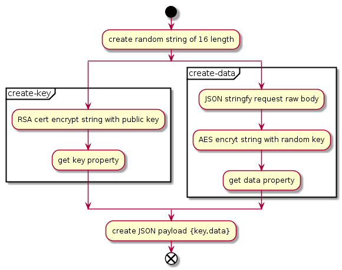
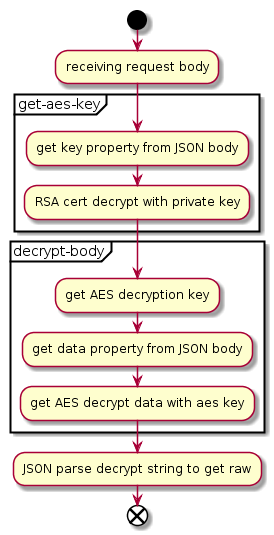

# GraphQL API Encryption Example

Remember run `npm install` in project root and client folder

## Memo

this project is for quick start a apollo(GraphQL) react frontend and GraphQL nodejs backend based on [this](https://www.youtube.com/watch?v=DKzprvzbS14) tutorial video, many thanks to Traversy Media.

### Schema

```sh
.
├── LICENSE
├── README.md
├── client // all frontend code
├── config // nodejs server config
├── middleware // encryption middleware
├── package-lock.json
├── package.json
├── schema.js // graphql schema file
└── server.js // express server entry
```

### What's new here

Simply add post data encryption between request and server middleware, replace default fetcher with axios in apollo-client.

Add decryption middleware before express-graphql for decrypting data to main graphql server.

### How encryption works

encryption method includes RSA 1024 and AES 128 mode ECB pkcs7 padding

#### client side



#### server side

